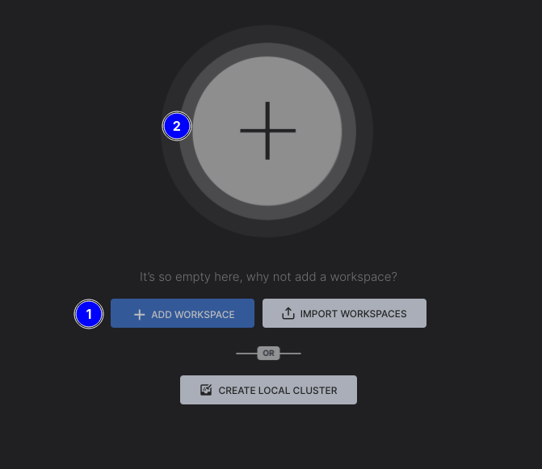
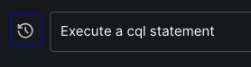
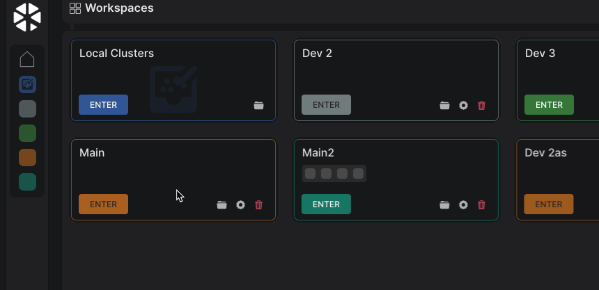
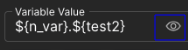
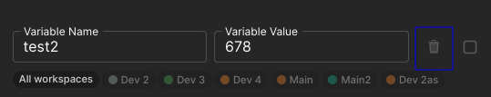

## 1. Intro Window

>  You should see a checkbox during the first launch.
> 
> 

- 1.1  Check the check box to proceed.
  
  - [ ] 1.1.1  The intro window has been destroyed, and the main window has been displayed.

- [ ] 1.2  The checkbox hasn't been displayed in the next launch.

## 2. Main Window

### 2.1 Add Workspace Process

> 

- 2.1.1  Click the "**ADD WORKSPACE**" button *#1*, or the "**+**" button *#2* at the center of the window.
  
  - [ ] 2.1.1.1  A related dialog (#2.1.2) has been displayed when the "**ADD WORKSPACE**" button has been clicked.
  - [ ] 2.1.1.2  Same behavior for the "**+**" button.

- 2.1.2 **<u>Add Workspace Dialog</u>**.
  
  > 
  
  - 2.1.2.1 **<u>Input fields, Icons and Buttons</u>**.
    
    - 2.1.2.1.1 "**Workspace Name**" text field.
      
      > 
      
      - 2.1.2.1.1.1  Invalid cases that should not be accepted:
        
        - [ ] 2.1.2.1.1.1.1  Only whitespaces.
        
        - [ ] 2.1.2.1.1.1.2  Duplicated name with another workspace (case insensitive).
          
          >  To perform this test you should click the "ADD WORKSPACE" button and get an error.
        
        - [ ] 2.1.2.1.1.1.3  Only symbols that will be removed during the sanitization process (such as `|`, and `/`), so the workspace's folder name will be empty.
          
          >  To perform this test you should click the "ADD WORKSPACE" button and get an error.
      
      - [ ] 2.1.2.1.1.2  Otherwise, the name should be accepted - no red border covering the input field -.
    
    - 2.1.2.1.2 "**Workspace Color**" text field.
      
      > 
      
      - 2.1.2.1.2.1  Click the text field or focus on it.
        
        - [ ] 2.1.2.1.2.1.1  A color picker dialog has been displayed.
          
          > 
      
      - [ ] 2.1.2.1.2.2  A color must be set, there's no way to let the text field empty.
    
    - 2.1.2.1.3 "**Workspace Path**" text field and its **Icon**.
      
      > 
      
      - 2.1.2.1.3.1 **The text field** *#1*.
        
        - 2.1.2.1.3.1.1  Click the text field.
          
          - [ ] 2.1.2.1.3.1.1.1  A directory selection dialog has been displayed.
            
            > 
        
        - 2.1.2.1.3.1.1.2  Invalid cases that should not be accepted.
          
          - [ ] 2.1.2.1.3.1.1.2.1  Inaccessible path for any reason.
            
            >  To perform this test you should click the "ADD WORKSPACE" button and get an error.
          
          - [ ] 2.1.2.1.3.1.1.2.2  Path where there's a folder with the same name as the workspace's folder - after the sanitization process -.
            
            >  To perform this test you should click the "ADD WORKSPACE" button and get an error.
      
      - [ ] 2.1.2.1.3.1.1.3  Otherwise, the path should be accepted.
    
    - 2.1.2.1.3.2 "**Set default path**" icon *#2*.
      
      - 2.1.2.1.3.2.1  Related to the test (#2.1.2.1.3.1), change the default directory to something else.
      
      - 2.1.2.1.3.2.2  Click the icon #2.
        
        - [ ] 2.1.2.1.3.2.2.1  The path has been reverted to the default one.
    
    - 2.1.2.1.4 **<u>Footer buttons</u>**.
      
      > 
      
      - 2.1.2.1.4.1 "**CLOSE**" button *#1*.
        
        - [ ] 2.1.2.1.4.1.1  The related dialog (#2.1.2) was hidden when this button was clicked.
        
        - [ ] 2.1.2.1.4.1.2  Same behavior as the X icon at the top right of the dialog .
      
      - 2.1.2.1.4.2 "**ADD WORKSPACE**" button *#2*.
        
        - [ ] 2.1.2.1.4.2.1  Clicking this button caused to create a workspace with a success feedback.
        
        - [ ] 2.1.2.1.4.2.2  In case there's an invalid input, an error feedback showed up.
  
  - 2.1.2.2 **<u>Add a bunch of workspaces</u>**.
    
    > 
    
    - 2.1.2.2.1   After finishing the test (#2.1.2), add about 3-4 workspaces.
      
      >  For the upcoming tests, make sure to change the default path of one workspace at least.
      
      - [ ] 2.1.2.2.1.1  All workspaces have been added with a success feedback.
    
    - [ ] 2.1.2.2.2  After adding the first workspace with success, the view has been changed, and the workspace has been displayed as a card - as the embedded image under this test (#2.1.2.2) -.
      
      >  After adding the first workspace, you can click the "**ADD WORKSPACE**" button at the top right side of the window.  

### 2.2 Processes Of An Added Workspace

> 

- 2.2.1 "**Workspace folder**" button.
  
  - 2.2.1.1  Click the button with the folder icon - the first one from the left side -  for any added workspace.
    
    - [ ] 2.2.1.1.1  File explorer opened pointing at the workspace's folder.
    
    - [ ] 2.2.1.1.2  All workspaces folders - especially with custom path - have been opened with success.

- 2.2.2 "**Workspace settings**" button.
  
  - 2.2.2.1  Click the button with the cog icon - the second one from the left side -  for any added workspace.
    
    - [ ] 2.2.2.1.1  An associated dialog (#2.1.2) showed up.
  
  - 2.2.2.2  Attempt to change the name, color, and path of a workspace - all at once, or separately -.
    
    - [ ] 2.2.2.2.1  Conditions for adding a workspace should be applied in this case too.

- 2.2.3 "**Delete workspace**" button.
  
  > 
  
  - 2.2.3.1  Click the button with the trash icon - the third one from left side -  for any added workspace.
    
    - [ ] 2.2.3.1.1  A related - confirmation - dialog (#2.2.3) has been displayed.
  
  - 2.2.3.2  Click the "**CANCEL**" button *#2*.
    
    - [ ] 2.2.3.2.1  Nothing should happen, the deletion process has been neglected.
  
  - 2.2.3.3  Click the "**CONFIRM**" button *#3*.
    
    - [ ] 2.2.3.3.1  The related workspace has been deleted and its card has been removed from the UI.
  
  - 2.2.3.4  Click the button with the trash icon of another workspace.
    
    - 2.2.3.4.1  Check the checkbox *#1* then click the "**CONFIRM**" button *#3*.
      
      - [ ] 2.2.3.4.1.1  The related workspace has been deleted and its card has been removed from the UI, in addition, its files have been kept in the system.
        
        >  The workspace's folder has been changed by adding a prefix `_DEL_{randomString}`, for example `DEV 2_DEL_fa4b8`.

### 2.3 Add Connection Process

- 2.3.1 Click the "**ENTER**" button for any added workspace.
  
  > 
  
  - 2.3.1.1 The view has been changed.
    
    > 
  
  - 2.3.1.2 Click the "**ADD CONNECTION**" button *#1*, or the "**+**" button at the center of the window *#2*, or the "**ADD CONNECTION**" button *#3* at the top right side of the window.
    
    - 2.3.1.2.1 A related dialog (#2.3.2) has been displayed after clicking the "**ADD CONNECTION**" button of both *#1*, or *#3*.
    
    - 2.3.1.2.2 Same behavior for the "**+**" button.

- 2.3.2 **<u>Add Connection Dialog</u>**.
  
  > 
  
  - 2.3.2.1 **<u>Input fields, Icons and Buttons</u>**.
    
    - 2.3.2.1 **<u>"Basic" section</u>**.
      
      - 2.3.2.1.1 "**Connection Name**" text field.
        
        > 
        
        - 2.3.2.1.1.1  Invalid cases that should not be accepted.
          
          - [ ] 2.3.2.1.1.1.1  Only whitespaces.
            
            >  To perform this test you should click the "ADD CONNECTION" button and get an error.
          
          - [ ] 2.3.2.1.1.1.2  Duplicated name with other connection in the same workspace (case insensitive).
            
            >  To perform this test you should click the "ADD CONNECTION" button and get an error.
          
          - [ ] 2.3.2.1.1.1.3  Only symbols that will be removed during the sanitization process (such as `|`, and `/`), so the connection's folder name will be empty.
            
            >  To perform this test you should click the "ADD CONNECTION" button and get an error.
          
          - [ ] 2.3.2.1.1.1.4  Otherwise, the name should be accepted.
      
      - 2.3.2.1.2 "**Cassandra Data Center**" text field.
        
        > 
        
        - [ ] 2.3.2.1.2.1  This field can be left empty without stopping the testing/adding process.
        
        - [ ] 2.3.2.1.2.2  When adding a data center that doesn't exist, an error has been shown.
          
          > 
      
      - 2.3.2.1.3 "**Cassandra Host Name**" text field.
        
        > 
        
        - [ ] 2.3.2.1.3.1  This field can't be left empty.
      
      - 2.3.2.1.4 "**Port**" text field:
        
        > 
        
        - [ ] 2.3.2.1.3.2  This field can't be left empty.
    
    - 2.3.2.2 **<u>"Authentication" section</u>**.
      
      > 
      
      - [ ] 2.3.2.2.1  When keeping the checkbox *#1* checked, credentials have be saved in the OS keychain.
        
        >  To perform this test you should add a connection, then attempt to edit that connection to see if authentication credentials are filled up automatically in the fields.
      
      - [ ] 2.3.2.2.2  When unchecking the checkbox *#1*, credentials haven't been saved in the OS keychain, and a dialog shows up with each test/connect process.
        
        >  To perform this test you should add a connection, then attempt to either test or activate that connection.
    
    - 2.3.2.3 **<u>"SSH Tunnel" section</u>**.
      
      > 
      
      - [ ] 2.3.2.3.1  When keeping the checkbox *#1* checked, credentials have been saved in the OS keychain.
        
        >  To perform this test you should add a connection, then attempt to edit that connection to see if authentication credentials are filled up automatically in the fields.
      
      - [ ] 2.3.2.3.2  When unchecking the checkbox *#1*, credentials haven't been saved in the OS keychain, and a dialog shows up with each test/connect process.
        
        >  To perform this test you should add a connection, then attempt to either test or activate that connection.
    
    - 2.3.2.4 "**SWITCH EDITOR**" button.
      
      > 
      
      - 2.3.2.4.1  Click the button *#1* in the dialog's footer section.
        
        - [ ] 2.3.2.4.1.1  The view in the dialog changed to an editor.
          
          >  
          > 
          > - To expand the editor, click the expand icon  beside the button *#1*. Click the icon again to shrink the editor.
          > 
          > - You can also zoom-in and out the editor using CTRL and the mouse wheel.
        
        - 2.3.2.4.1.2  Attempt to change any value in the editor like; `hostname` under the `[connection]` section.
          
          > 
          
          - [ ] 2.3.2.4.1.2.1  The change has been implemented in the UI, in the "**Basic**" section (#2.3.2.1) for the "**Cassandra Host Name**" text field (#2.3.2.1.3).
        
        - 2.3.2.4.1.3  Attempt to paste a cqlsh.rc content.
          
          - 2.3.2.4.1.3.1  For a valid `cqlsh.rc` file you have, attempt to paste it entirely into the editor.
            
            - [ ] 2.3.2.4.1.3.1.1  All values that have associated UI elements their value have been updated as well.
        
        - 2.3.2.4.1.4 **Pre and post connection scripts**.
          
          > 
          
          >  This feature allows for executing scripts, or any executables in either the pre or post-connection phase. Added scripts should return `0`; which indicates success, any other returned value will be considered to be a failure.
          > 
          > - While focusing on the editor, press CTRL+F to search inside it.
          > 
          > - Look for `[preconnect]` and `[postconnect]` sections, and have a look at the description.
          
          -  2.3.2.4.1.4.1 Add scripts/executables/bat files paths to be executed in the pre-connection phase.
          
          -  2.3.2.4.1.4.2 Add scripts/executables/bat files paths to be executed in the post-connection phase.
    
    - 2.3.2.5 "**TEST CONNECTION**" button.
      
      > 
      
      - 2.3.2.5.1  After finishing previous tests, click the button *#1* in the dialog's footer section.
        
        - [ ] 2.3.2.5.1.1  A spinner *#1* showed up, and an `X` button *#2* showed up after a short time.
          
          > 
          
          - 2.3.2.5.1.1.1  Click the `X` button *#2*.
            
            - [ ] 2.3.2.5.1.1.1.1  The test process has been terminated, a feedback message showed up.
        
        - [ ] 2.3.2.5.1.2  On failure, an error showed up with details about the cause of it.
          
          > 
        
        - [ ] 2.3.2.5.1.3  On success, the button "**ADD CONNECTION**" *#1* enabled now, and a success message *#2* showed up.
          
          > 
    
    - 2.3.2.6 "**ADD CONNECTION**" button.
      
      > 
      
      - 2.3.2.6.1  After finishing the test (#2.3.2.5) with success, button #1 should be enabled, click it.
        
        - 2.3.2.6.1.1  On success.
          
          > 
          
          - [ ] 2.3.2.6.1.1.1  The connection has been added under the current active workspace.
          
          - [ ] 2.3.2.6.1.1.2  The added connection is ready to be activated - green glowing circle, Cassandra version, and data center are known and provided -.
        
        - [ ] 2.3.2.6.1.2  On failure, an error showed up with details about the cause of it.

- 2.3.3 **<u>Add a bunch of connections</u>**.
  
  > 
  
  - 2.3.3.1  After finishing the test (#2.3.2), add about 3-4 connections.
    
    >   We can add the same connection info - except its name, related to test (#2.3.2.1.1) -.
  
  - [ ] 2.3.3.2  All connections have been added with success feedback.
  
  - [ ] 2.3.3.3  After adding the first connection with success, the view has been changed and the connection has been displayed as a card - as the embedded image under this test (#2.3.3) -.
    
    >   After adding the first connection, you can click the "**ADD CONNECTION**" button at the top right side of the window .

### 2.4 Processes Of An Added Connection

> 

- 2.4.1 "**Connection folder**" button.
  
  - 2.4.1.1  Click the button with the folder icon - the first one from the left side -  for any added connection.
    
    - [ ] 2.4.1.1.1  File explorer opened pointing at the connection's folder.

- 2.4.2 "**Connection settings**" button.
  
  - 2.4.2.1  Click the button with the cog icon - the second one from the left side -  for any added connection.
    
    - [ ] 2.4.2.1.1  An associated dialog (#2.3.2) showed up.
    
    - [ ] 2.4.2.1.2  Conditions of adding a connection should be applied in this case too.

- 2.4.5 "**Delete connection**" button.
  
  > 
  
  - 2.4.5.1  Click the button with the trash icon - the third one from left side -  for any added connection.
    
    - [ ] 2.4.5.1.1  A related - confirmation - dialog (#2.4.5) has been displayed.
  
  - 2.4.5.2  Click the "**CANCEL**" button *#2*.
    
    - [ ] 2.4.5.2.1  Nothing should happen, the deletion process has been neglected.
  
  - 2.4.5.3  Click the "**CONFIRM**" button *#3*.
    
    - [ ] 2.4.5.3.1  The related connection has been deleted and its card has been removed from the UI.
  
  - 2.4.5.4  Click the button with the trash icon of another connection.
    
    - 2.4.5.4.1  Check the checkbox *#1* then click the "**CONFIRM**" button *#3*.
      
      - [ ] 2.4.5.4.1.1  The related connection has been deleted and its card has been removed from the UI, in addition, its files have been kept in the system.
        
        >  The connection's folder has been changed by adding a prefix `_DEL_{randomString}`, example `Main_DEL_fa4b8`.

- 2.4.6 "**TEST CONNECTION**" button.
  
  > 
  
  - 2.4.6.1  Click the button *#1* of any added connection.
    
    - [ ] 2.4.6.1.1  Related to tests (#2.3.2.2.2) and (#2.3.2.3.2), a related dialog would show up.
      
      > 
      
      - [ ] 2.4.6.1.1.1  after clicking the button "IGNORE CREDENTIALS" #1, the workbench has considered the connection to be credential-free, and it won't ask about credentials in the next test/connect.
      - [ ] 2.4.6.1.1.2  When clicking the button "PROCEED" #2 - after providing the necessary credentials -, the test (#2.4.5.2.1) has started.
      - [ ] 2.4.6.1.1.3  When checkbox #3 is checked then the button "PROCESSED" #2 is clicked. The workbench won't ask about credentials in the next test/connect.
    
    - [ ] 2.4.6.1.2  Changes happend in the UI - a spinner *#1* showed up, and an `X` button *#2* showed up after a short time.
      
      > 
      
      - 2.4.6.1.2.1  Click the `X` button *#2*.
        
        - [ ] 2.4.6.1.2.1.1  The test process has been terminated, a feedback message showed up.
    
    - [ ] 2.4.6.1.2  The test process finished with feedback - of success or failure -.

- 2.4.7 "**CONNECT**" button.
  
  > 
  
  >  After finishing the test (#2.4.6) with success, activating the connection will immediately create a work area, otherwise, when clicking the button "CONNECT" it'll automatically test the connection first, then activate it.
  
  -  2.4.7.1 Click the button *#1* of any added connection.
    
    > 
    > 
    > - As mentioned in the info card, in case this is the first attempt to connect after adding the connection, or after a successful connection test the workbench will immediately attempt to create a work area.
    > 
    > - Otherwise, clicking this button will cause the same behavior in the test (#2.4.6.1), then it'll create a work area.
    
    - [ ] 2.4.7.1.1  After a successful connection test - either automatically related to the test (#2.4.6) or manually -, a work area showed up.
      
      > 

#### 2.4.1 Active Connection Workarea

> 

>  This test assumes that test (2.4.6) and (2.4.7) were finished with success.

- 2.4.1.1 <u>"**Connection Info Card**" *#1*</u>.
  
  > 
  
  - [ ] 2.4.1.1.1  The hostname, Cassandra version, and the data center are correctly provided.
  
  - 2.4.1.1.2  The lock icon at the top right side of the card .
    
    - [ ] 2.4.1.1.2.1  In case SSL is not enabled, it's an opened-lock with a tooltip "*SSL is not enabled*".
    
    - [ ] 2.4.1.1.2.2  In case SSL is enabled, it's a colored closed-lock with a tooltip "*SSL is enabled*".

- 2.4.1.2 <u>"**Metadata Tree View**" *#2*</u>.
  
  > 
  
  - 2.4.1.2.1  **<u>Info about the connected-to cluster/node</u>**.
    
    - [ ] 2.4.1.2.1.1  Cluster name and the partitioner.
    
    - [ ] 2.4.1.2.1.2  List of all keyspaces - virtual and system keyspaces are grouped under Virtual Keyspaces (`${numberOfVirtualKeyspaces}`) and System Keyspaces (`${numberOfSystemKeyspaces}`)  respectively.
      
      - [ ] 2.4.1.2.1.2.1  All tables inside each keyspace.
        
        - [ ] 2.4.1.2.1.2.1.1  All associated tables' data like keys, columns, options, triggers if any, and alike.
  
  - 2.4.1.2.2 **<u>Metadata Tree View Actions</u>**.
    
    > 
    
    - 2.4.1.2.2.1  Click the copy icon *#1*.
      
      - [ ] 2.4.1.2.2.1.1  The entire metadata has been copied to the clipboard as a JSON string, the workbench showed a feedback of success with the size of the copied JSON string.
        
        > 
    
    - 2.4.1.2.2.2  Click the refresh icon *#2*.
      
      > 
      
      - [ ] 2.4.1.2.2.2.1  The loading spinner has been shown again.
      
      - [ ] 2.4.1.2.2.2.2  All metadata actions were disabled during the refresh process.
      
      - [ ] 2.4.1.2.2.2.3  The tree view has been rendered again.
    
    - 2.4.1.2.2.2  Click the search icon *#3*.
      
      - 2.4.1.2.2.2.1 An input field showed up at the top of the tree view.
        
        > 
        
        - 2.4.1.2.2.2.1.1  Attempt to search for something, like `frozen`.
          
          > 
          
          - [ ] 2.4.1.2.2.2.1.1.1  The tree has been filtered.
          
          - [ ] 2.4.1.2.2.2.1.1.2  The number of search results *#1* and the ID of the current result *#1* are displayed on the right side of the input field.
          
          - [ ] 2.4.1.2.2.2.1.1.3  Up and down arrows *#2* are displayed on the right side of the input field to navigate between results.
            
            - [ ] 2.4.1.2.2.2.1.1.3.1  Arrows are navigating as expected through the search results.
          
          - [ ] 2.4.1.2.2.2.1.1.4  Results are highlighted well and distinguishable *#3*.
          
          - [ ] 2.4.1.2.2.2.1.1.5  All results are correct - the search string certainly exists in the highlighted nodes - *#3*.
          
          - [ ] 2.4.1.2.2.2.1.1.6  Search is case insensitive.
        
        - 2.4.1.2.2.2.1.2  Clear the input field.
          
          - [ ] 2.4.1.2.2.2.1.2.1  All nodes are now displayed with no filter.
        
        - 2.4.1.2.2.2.1.3  Click the search icon again and search for something.
          
          - 2.4.1.2.2.2.1.3.1 Click the search icon again without clearing the field.
            
            - [ ] 2.4.1.2.2.2.1.3.1.1  All nodes are now displayed with no filter.
  
  - 2.4.1.2.3 **<u>Resize the left side of the workarea</u>**.
    
    - 2.4.1.2.3.1  Move the mouse closer to the left edge of the workspace.
      
      > 
      
      - [ ]  2.4.1.2.3.1.1 The left side has been resized as expected.

- 2.4.1.3 <u>"**Workarea Sections**" *#3*</u>.
  
  - 2.4.1.3.1 "**<u>CQLSH Session</u>**" Section.
    
    > 
    
    > 
    > 
    > - #1: In the workarea's different sections, we can navigate to any section via its tab.
    > 
    > - #2: The search area in the "CQLSH SESSION" section, here we can search for a specific string in output *#3*.
    > 
    > - #3: The blocks' container, where all output of the current session is shown here as blocks, the block consists of:
    >   
    >   - #5 The header: Either title or cql statement(s).
    >   
    >   - #6 The body: The content of the block, either plain text - could be converted from ANSI -, or rendered tables and objects.
    >   
    >   - #7: Actions: different block's actions like delete, copy, query tracing, download, and more.
    > 
    > - #4: Execution area: where we type and execute cql statements or cqlsh commands, and browser statements history.
    
    - 2.4.1.3.1.1 "**<u>Execution Area</u>**" *#4*.
      
      > 
      
      - 2.4.1.3.1.1.1  **<u>Execute simple statement like `tracing on`</u>**.
        
        > 
        
        - 2.4.1.3.1.1.1.1  Focus on the input field in the execution area.
        
        - 2.4.1.3.1.1.1.2  Start typing `t` letter.
          
          - [ ] 2.4.1.3.1.1.1.2.1   Suggestions feature has been started.
        
        - 2.4.1.3.1.1.1.3  Type `tr` letters:
          
          - [ ] 2.4.1.3.1.1.1.3.1   `truncate` word is suggested by the workbench to be auto-typed.
        
        - 2.4.1.3.1.1.1.4  Click `TAB`.
          
          - [ ] 2.4.1.3.1.1.1.4.1   The word `truncate` has been auto-typed.
          
          - 2.4.1.3.1.1.1.4.2  Click `TAB` key again.
            
            - [ ] 2.4.1.3.1.1.1.4.2.1   The word `tracing` has been auto-typed.
        
        - 2.4.1.3.1.1.1.5  Click `TAB` key multiple times.
          
          - [ ] 2.4.1.3.1.1.1.5.1   The workbench cycled throw the two suggestions.
        
        >  You can click the suggestion to auto-typed it.
        > 
        > 
        
        - 2.4.1.3.1.1.1.6  Continue with typing `tracing on`, now either click the "**ENTER**" key, or the execution button at the right side of the area.
          
          > 
          
          - [ ] 2.4.1.3.1.1.1.6.1  The statement has been executed and the input field has been cleared *#3*.
          
          - [ ] 2.4.1.3.1.1.1.6.3  A new block showed up at the bottom of the blocks' container *#1*.
            
            - [ ] 2.4.1.3.1.1.1.6.3.1  The statement is syntax highlighted.
            
            - 2.4.1.3.1.1.1.6.3.2  Hover the mouse closer to the block's statement.
              
              > 
              
              - [ ] 2.4.1.3.1.1.1.6.3.2.1 A copy icon showed up at the bottom right side of the statement.
                - 2.4.1.3.1.1.1.6.3.2.1.1  Click the icon.
                  - [ ] 2.4.1.3.1.1.1.6.3.2.1.1.1 The statement has been copied to the clipboard.
          
          - [ ] 2.4.1.3.1.1.1.6.4  The history button at the left side of the input field has been enabled *#2*.
      
      - 2.4.1.3.1.1.2  **<u>Execute statement with records like `select * from system_views.clients;`</u>**.
        
        > 
        
        - 2.4.1.3.1.1.2.1  Type the statement `select * from system_views.clients`.
          
          - [ ] 2.4.1.3.1.1.2.1.1  Without typing a semicolon at the end `;`, the execution button is still disabled and we can't execute the statement.
            
            >  The workbench detects which statements need a semicolon and which don't.
          
          - 2.4.1.3.1.1.2.1.2  Type `;` at the end and execute the statement.
            
            - [ ] 2.4.1.3.1.1.2.1.2.1  The statement has been executed and the input field has been cleared.
            
            - [ ] 2.4.1.3.1.1.2.1.2.2  The statement is syntax highlighted *#1*.
            
            - [ ] 2.4.1.3.1.1.2.1.2.3  A new block showed up at the bottom of the blocks' container.
              
              - [ ] 2.4.1.3.1.1.2.1.2.3.1  The workbench automatically scrolled to the bottom of the container.
              
              - [ ] 2.4.1.3.1.1.2.1.2.3.2  Inside the block a table has been rendered containing the related table's columns and records *#2*.
                
                - [ ] 2.4.1.3.1.1.2.1.2.3.2.1  By typing inside the text fields of any column, records have been filtered *#3*.
                
                - [ ] 2.4.1.3.1.1.2.1.2.3.2.2  The order of the columns has been changed by dragging and dropping them.
                
                - [ ] 2.4.1.3.1.1.2.1.2.3.2.3  The order of records has been changed by clicking the right side arrow inside headers *#4* .
                
                - 2.4.1.3.1.1.2.1.2.3.2.4  Click the download icon at the bottom right of the container *#5*.
                  
                  > 
                  
                  - [ ] 2.4.1.3.1.1.2.1.2.3.2.4.1  Two options showed up to download the table as either *CSV* or *PDF* formats *#5*.
                  
                  - 2.4.1.3.1.1.2.1.2.3.2.4.2  Download the rendered table in both formats.
                    
                    - [ ] 2.4.1.3.1.1.2.1.2.3.2.4.2.1  Both formats are fine and incorrupted.
              
              - 2.4.1.3.1.1.2.1.2.3.3 "**<u>Query Tracing</u>**" feature.
                
                - 2.4.1.3.1.1.2.1.2.3.3.1  Click the tracing icon at the bottom right of the container *#6*.
                  
                  > 
                
                - [ ] 2.4.1.3.1.1.2.1.2.3.3.2  Tab "Query Tracing" is now the active one, the section has been changed to query tracing results.
                  
                  > 
                
                - [ ] 2.4.1.3.1.1.2.1.2.3.3.3  The tracing results of the statement/query `select * from system_views.clients;` are showed up.
                  
                  - 2.4.1.3.1.1.2.1.2.3.3.3.1  Click the header badge at the top left side of the block *#1*.
                    
                    - [ ] 2.4.1.3.1.1.2.1.2.3.3.3.1.1  The view has been minimized to charts only.
                    
                    - 2.4.1.3.1.1.2.1.2.3.3.3.1.2  Click the header badge again *#1*.
                      
                      - [ ] 2.4.1.3.1.1.2.1.2.3.3.3.1.2.1  The view has been reverted to its normal state again.
                  
                  - 2.4.1.3.1.1.2.1.2.3.3.3.2  Click the copy button at the top right side of the activities table *#2*.
                    
                    - [ ] 2.4.1.3.1.1.2.1.2.3.3.3.2.1  The table has been copied to the clipboard in JSON string format.
      
      - 2.4.1.3.1.1.3  **<u>Execute bunch of statements with different cases</u>**.
        
        - 2.4.1.3.1.1.3.1  Execute two statements in one action like `SELECT * FROM system_schema.keyspaces; select * from system_views.clients;`.
          
          > 
          
          > 
          > 
          > Statements can be executed line by line instead of one line - make sure to click <kbd>SHIFT</kbd>+<kbd>ENTER</kbd> to add a new line in the input field -, like:
          > 
          > ```sql
          > SELECT * FROM system_schema.keyspaces;
          > select * from system_views.clients;
          > ```
          
          - [ ] 2.4.1.3.1.1.3.1.1  Both statements have been executed, and a new block showed up with two outputs *#1*.
          
          - [ ] 2.4.1.3.1.1.3.1.2  A new right-side badge showed up with "*2 statements*" phrase *#2*.
        
        - 2.4.1.3.1.1.3.2  Execute three statements in one action like `SELECT * FROM system_schema.keyspaces; select * from system.peers; select * from system_views.clients;`.
          
          > 
          
          - [ ] 2.4.1.3.1.1.3.2.1  The three statements have been executed, and a new block showed up with three outputs *#1*.
          
          - [ ] 2.4.1.3.1.1.3.2.2  The output of the second statement `select * from system.peers;` is "CQL statement executed - No data found" *#2*.
          
          - [ ] 2.4.1.3.1.1.3.2.3  A new right-side badge showed up with "*3 statements*" phrase *#3*.
        
        - 2.4.1.3.1.1.3.3  Execute an invalid statement that would interrupt the execution flow like `not_valid';`.
          
          > 
          
          - [ ] 2.4.1.3.1.1.3.3.1  The statement has been executed, and a new block showed up.
          
          - [ ] 2.4.1.3.1.1.3.3.2  After a short time, an `X` button *#1* showed up with pinned tooltip *#2* about an interruption of the execution flow.
            
            - [ ] 2.4.1.3.1.1.3.3.2.1  Without clicking the button *#1*, there's no way to run further statements or interact freely in the enhanced terminal.
            
            - [ ] 2.4.1.3.1.1.3.3.2.2  After clicking the button *#1*, the infinite loader was removed from the block, and an info message showed up, and the interruption has been handled.
              
              > 
        
        - 2.4.1.3.1.1.3.4  Execute three statements in one action and one of them is invalid.
          
          - 2.4.1.3.1.1.3.4.1  Execute all of them in one line like `SELECT * FROM system_schema.keyspaces; invalid'; select * from system.peers;`.
            
            - [ ] 2.4.1.3.1.1.3.4.1.1  None of them have been executed, the entire execution process has been considered to be invalid.
          
          - 2.4.1.3.1.1.3.4.2  Execute them and put each one in line like:
            
            ```sql
            SELECT * FROM system_schema.keyspaces;
            invalid';
            select * from system.peers;
            ```
            
            - [ ] 2.4.1.3.1.1.3.4.2.1  The first and second statements have been executed, and then the execution flow stopped.
              - [ ] 2.4.1.3.1.1.3.4.2.1.1  After clicking the `X` button the info message showed up at the bottom of the block.
          
          - 2.4.1.3.1.1.3.4.3  Change the order of the statements by putting the invalid statement first, like:
            
            ```sql
            invalid';
            SELECT * FROM system_schema.keyspaces;
            select * from
            ```
            
            - [ ] 2.4.1.3.1.1.3.4.3.1  The first one has been executed, and then the entire execution process has been considered to be invalid.
          
          - 2.4.1.3.1.1.3.4.4  Change the order of the statements again by putting the invalid statement at last, like:
            
            ```sql
            SELECT * FROM system_schema.keyspaces;
            select * from
            invalid';
            ```
            
            - [ ] 2.4.1.3.1.1.3.4.5  All of them have been executed, and then the execution flow stopped.
              
              - [ ] 2.4.1.3.1.1.3.4.5.1  After clicking the `X` button the info message showed up at the bottom of the block.
          
          > 
          > 
          > "Invalid" description in Cassandra context refers to different states, here, however, it refers to a statement that causes the execution flow to be stopped while waiting for interaction from the user, in cqlsh tool those kind of statements causes this:
          > 
          > 
          > 
          > This is different from an "invalid" statement that might return an error like attempting to select from a table that doesn't exist, in this case, the execution flow won't be interrupted, and actually, if we executed `invalid;` without the single quote then this statement would be considered to be invalid but won't cause an execution flow interruption.
          
          >  The behavior of executing statements while there's an invalid input is different on Windows from Linux and macOS; mostly, on Windows the execution flow will be interrupted regardless of the position or order of the invalid statement, in other words, if we have multiple statements and one of them is invalid, none of them would be executed, and it doesn't matter its order.
          
          - [ ] 2.4.1.3.1.1.3.5  **Windows users only**: The mentioned behavior is confirmed.
      
      - 2.4.1.3.1.1.4  **<u>Create new keyspace and table</u>**.
        
        - 2.4.1.3.1.1.4.1  Create a new keyspace statement like `CREATE KEYSPACE test1 WITH replication = {'class': 'SimpleStrategy', 'replication_factor': '1'} AND durable_writes = true;`.
          
          - [ ] 2.4.1.3.1.1.4.1.1  A new block showed up at the bottom of the container with the output "*CQL statement executed*".
          
          - [ ] 2.4.1.3.1.1.4.1.2  The metadata tree view has been refreshed automatically.
            
            - [ ] 2.4.1.3.1.1.4.1.2.1  The created keyspace `test1` exists in the tree view.
          
          - 2.4.1.3.1.1.4.1.3  Re-execute the same statement.
            
            - [ ] 2.4.1.3.1.1.4.1.3.1  A new block showed up with error the output "*AlreadyExists: Keyspace 'test1' already exists*".
            
            - [ ] 2.4.1.3.1.1.4.1.3.2  The tree view hasn't been refreshed this time.
              
              >  The workbench automatically detects when the metadata should be refreshed and when it's not.
        
        - 2.4.1.3.1.1.4.2  Create new table statement like `CREATE TABLE test1.test_table (id timeuuid PRIMARY KEY, num int);`.
          
          - [ ] 2.4.1.3.1.1.4.2.1  A new block showed up at the bottom of the container with the output "*CQL statement executed*".
          
          - [ ] 2.4.1.3.1.1.4.2.2  The metadata tree view has been refreshed automatically.
            
            - [ ] 2.4.1.3.1.1.4.2.2.1  The created table `test_table` in keyspace `test1` exists in the tree view.
          
          - 2.4.1.3.1.1.4.2.3  Re-execute the same statement.
            
            - [ ] 2.4.1.3.1.1.4.2.3.1  A new block showed up with error the output "*AlreadyExists: Table 'test1.test_table' already exists*".
            
            - [ ] 2.4.1.3.1.1.4.2.3.2  The tree view hasn't been refreshed this time.
      
      - 2.4.1.3.1.1.5  **<u>History Statements</u>**.
        
        >  All executed statements are being saved in the workbench's local storage, each connection has its own space of storage and a 50 saved statements at max - group of statements executed in one action are considered as one statement -.
        
        - 2.4.1.3.1.1.5.1  Click the history icon at the left side of the execution area.
          
          > 
          
          - 2.4.1.3.1.1.5.1.1 A list showed up contains statements that have been executed.
            
            > 
            
            - 2.4.1.3.1.1.5.1.1.1  Click area *#1*, or area *#2* and *#3* around the icons - the background color will be changed indicating a possible click -.
              
              > 
              
              - [ ] 2.4.1.3.1.1.5.1.1.1.1  The statement has been filled in the input text automatically.
              
              - [ ] 2.4.1.3.1.1.5.1.1.1.2  The list has been closed automatically.
            
            - 2.4.1.3.1.1.5.1.1.2  Open the list again, and click the copy icon *#2* for any statement .
              
              - [ ] 2.4.1.3.1.1.5.1.1.2.1  The statement has been copied to the clipboard.
              
              - [ ] 2.4.1.3.1.1.5.1.1.2.2  The list hasn't been closed, it's still displayed.
            
            - 2.4.1.3.1.1.5.1.1.3  Click the trash icon *#3* for any statement .
              
              - [ ] 2.4.1.3.1.1.5.1.1.3.1  The statement has been deleted from the list.
            
            - 2.4.1.3.1.1.5.1.1.4  Click the button *#4* at the bottom right side of the list.
              
              > 
              
              - [ ] 2.4.1.3.1.1.5.1.1.4.1  The list has been closed as all statements have been deleted.
              
              - [ ] 2.4.1.3.1.1.5.1.1.4.2  The history icon has been disabled.
            
            - 2.4.1.3.1.1.5.1.1.5  Execute any statement like `expand on`.
              
              - [ ] 2.4.1.3.1.1.5.1.1.5.1  The history icon has been enabled again.
    
    - 2.4.1.3.1.2 "**<u>Blocks Search Area</u>**" *#2*.
      
      > 
      
      - 2.4.1.3.1.2.1  Click or focus on the search input field *#1*.
        
        - 2.4.1.3.1.2.1.1  Type something to search for in the blocks, like `tracing`.
          
          - [ ] 2.4.1.3.1.2.1.1.1  Blocks have been filtered with success.
            
            > 
      
      - 2.4.1.3.1.2.1.2  Clear the text inside the input field.
        
        - [ ] 2.4.1.3.1.2.1.2.1  All blocks are visible again.
      
      >  The workbench searches in the block's header - statement -, badges, and all output, so we can search for anything related to the block.
    
    - 2.4.1.3.1.3 "**<u>Blocks Container</u>**" *#3*.
      
      > 
      
      >  Most actions and processes of this area of the CQLSH session have been tested within the test (#2.4.1.3.1.1), in this test we'll attempt to cover the general, unrelated remaining actions and processes.
      
      - 2.4.1.3.1.3.1  **Copy block**.
        
        - 2.4.1.3.1.3.1.1  Click the copy icon *#1* of any created block .
          
          - [ ] 2.4.1.3.1.3.1.1.1  The output has been copied to the clipboard in JSON string format.
      
      - 2.4.1.3.1.3.2  **Delete block**.
        
        - 2.4.1.3.1.3.2.1  Click the trash icon *#2* of any created block .
          
          - [ ] 2.4.1.3.1.3.2.1.1  The block has been deleted.
        
        - 2.4.1.3.1.3.2.2  Delete all created block.
          
          - [ ] 2.4.1.3.1.3.2.2.1  The blocks' container is empty now and there's an icon with message indicates that.
            
            > 
  
  - 2.4.1.3.2 "**<u>CQL Description</u>**" Section.
    
    > 
    
    - 2.4.1.3.2.1  Click the tab *#1*.
      
      - [ ] 2.4.1.3.2.1.1  A new section has been shown instead of the CQLSH session (#2.4.1.3.1), the section is empty, with endless animated element *#2* and a clear hint *#3* at the bottom.
    
    - 2.4.1.3.2.2  Back to the metadata tree view (#2.4.1.2).
      
      > 
      
      - 2.4.1.3.2.2.1  Right mouse click at nodes like the entire cluster, any keyspace, table, and index. For example, right-click the `Cluster: {Name}` node.
        
        - [ ] 2.4.1.3.2.2.1.1  A right-click context menu showed up.
          
          - 2.4.1.3.2.2.1.1.1  Click the menu's item `Get CQL Description`.
            
            - [ ] 2.4.1.3.2.2.1.1.1.1  A spinner showed up at the left side of the node.
            
            - [ ] 2.4.1.3.2.2.1.1.1.2  An editor showed up in the `CQL Description` section with the `cql` description of the entire cluster.
              
              > 
              
              - 2.4.1.3.2.2.1.1.1.2.1  Click the `Expand Editor` button *#1*.
                
                - [ ] 2.4.1.3.2.2.1.1.1.2.1.1  The editor shrank and took nearly half of the section's view.
              
              - 2.4.1.3.2.2.1.1.1.2.1.2  Click the button *#1* again.
                
                - [ ] 2.4.1.3.2.2.1.1.1.2.1.2.1  The editor reverted to its previous height.
              
              - 2.4.1.3.2.2.1.1.1.2.1.3  Now back to the "CQLSH Session" section (#2.4.1.3.1).
      
      - 2.4.1.3.2.2.2  Expand the `Keyspaces (${numOfKeyspaces})` node.
        
        > 
        
        - 2.4.1.3.2.2.2.1  Right mouse click at any keyspace - you might need to expand either the `Virtual Keyspaces` or the `System Keyspaces` node -.
          
          - [ ] 2.4.1.3.2.2.2.1.1  A spinner showed up at the left side of the node.
          
          - [ ] 2.4.1.3.2.2.2.1.2  The workbench automatically navigated to the "**CQL Description**" section.
        
        - 2.4.1.3.2.2.2.2  Expand any keyspace like `system` keyspace under the `System Keyspaces` node.
          
          - 2.4.1.3.2.2.2.2.1  Expand its `Table (${numOfTables})` node.
            
            - 2.4.1.3.2.2.2.2.1.1  Attempt to right click and get the CQL description of multiple tables at the same time.
              
              - [ ] 2.4.1.3.2.2.2.2.1.1.1  The cql description of all tables has been successfully fetched and rendered.
  
  - 2.4.1.3.2 "**<u>Query Tracing</u>**" Section.
    
    - [ ] 2.4.1.3.2.1  This section's processes have been tested under the test (#2.4.1.3.1.1.2.1.2.3.3), confirm if it has been passed with its sub-tests.
  
  - 2.4.1.3.3 "**<u>Scheme Diff</u>**" Section.
    
    > 
    
    - 2.4.1.3.3.1  Click the tab *#1*.
      
      - [ ] 2.4.1.3.3.1.1  A new section has been shown, two editors with metadata content - JSON string format - in both.
    
    - 2.4.1.3.3.2  Back to the "CQLSH Session" section (#2.4.1.3.1).
      
      - 2.4.1.3.3.2.1  Create a new keyspace statement like `CREATE KEYSPACE test2 WITH replication = {'class': 'SimpleStrategy', 'replication_factor': '1'} AND durable_writes = true;`.
        
        - 2.4.1.3.3.2.1.1  Back to the "Scheme Diff" section (#2.4.1.3.3).
          
          - 2.4.1.3.3.2.1.1.1  At the bottom center of the section, click the refresh icon *#2* .
            
            - [ ] 2.4.1.3.3.2.1.1.1.1  The icon has been animated.
            
            - 2.4.1.3.3.2.1.1.1.2  Changes occurred in the section.
              
              - [ ] 2.4.1.3.3.2.1.1.1.2.1  The badge *#3* has been updated from `0` to `1` .
              
              - [ ] 2.4.1.3.3.2.1.1.1.2.2  Changes navigation arrows are enabled.
                
                > 
                
                - 2.4.1.3.3.2.1.1.1.2.1.1  Click the badge *#3* .
                  
                  > 
                  
                  - [ ] 2.4.1.3.3.2.1.1.1.2.1.1.1  List showed up with one change - both the start line of the change and its content are clear -.
                    
                    - 2.4.1.3.3.2.1.1.1.2.1.1.1.1  Click that change - the entire line of change is clickable -.
                      
                      - [ ] 2.4.1.3.3.2.1.1.1.2.1.1.1.1.1  Both editors scrolled down automatically to the the target line.
                      
                      - [ ] 2.4.1.3.3.2.1.1.1.2.1.1.1.1.2  The difference between the versions of the metadata is clear.
                
                - 2.4.1.3.3.2.1.1.1.2.1.2  Click the badge again.
                  
                  - [ ] 2.4.1.3.3.2.1.1.1.2.1.2.1  The list has been closed.
    
    - 2.4.1.3.3.3 "**<u>Scheme Snapshots</u>**".
      
      > 
      
      - 2.4.1.3.3.3.1 **<u>Save a snapshot</u>**.
        
        > 
        
        - 2.4.1.3.3.3.1.1  Click the disk icon *#1* .
          
          - [ ] 2.4.1.3.3.3.1.1.1  A related mini dialog showed up at the bottom of the window - as shown in the embedded GIF image -.
            
            > 
            
            - 2.4.1.3.3.3.1.1.1.1  Click the button *#1* without adding a suffix *#2*.
              
              - [ ] 2.4.1.3.3.3.1.1.1.1.1  The snapshot has been saved - a success feedback message showed up -.
          
          - 2.4.1.3.3.3.1.1.2  Click the icon *#1* again .
            
            - 2.4.1.3.3.3.1.1.2.1  Save the snapshot with any suffix.
              
              - [ ] 2.4.1.3.3.3.1.1.2.1.1  The snapshot has been saved - a success feedback message showed up -.
      
      - 2.4.1.3.3.3.2 **<u>List and load saved snapshots</u>**.
        
        - 2.4.1.3.3.3.2.1  Click the load icon *#2* .
          
          - [ ] 2.4.1.3.3.3.2.1.1  A related dialog showed up at the top of the window.
            
            > 
            
            - [ ] 2.4.1.3.3.3.2.1.1.1  There are two snapshots; the newest one with the suffix is the first one in the list from top.
              
              - 2.4.1.3.3.3.2.1.1.1.1  Click the load icon *#1* for any of the saved snapshots.
                
                > 
                
                - [ ] 2.4.1.3.3.3.2.1.1.1.1.1  The dialog has been closed automatically.
                
                - [ ] 2.4.1.3.3.3.2.1.1.1.1.2  The saved snapshot has been loaded in the "previous" left editor *#1*.
                
                - [ ] 2.4.1.3.3.3.2.1.1.1.1.3  Diff check has been automatically triggered, no changes have been detected now *#2*.
        
        - 2.4.1.3.3.3.2.2  Click the load icon *#2*  again.
          
          > 
          
          - [ ] 2.4.1.3.3.3.2.2.1  The related dialog showed up again at the top of the window.
          
          - 2.4.1.3.3.3.2.2.2  Click the trash icon for any of the saved snapshots.
            
            > 
            
            - 2.4.1.3.3.3.2.2.2.1  Click the "**CANCEL**" button *#1*.
              
              - [ ] 2.4.1.3.3.3.2.2.2.1.1  Nothing should happen, the deletion process has been neglected.
            
            - 2.4.1.3.3.3.2.2.2.2  Click the trash icon again.
              
              - 2.4.1.3.3.3.2.2.2.2.1  Check the checkbox *#2* and click the "**CONFIRM**" button *#3*.
                
                - [ ] 2.4.1.3.3.3.2.2.2.2.1.1  The snapshot has been deleted.
                  
                  - [ ] 2.4.1.3.3.3.2.2.2.2.1.1.1  A success message showed up.
                  
                  - [ ] 2.4.1.3.3.3.2.2.2.2.1.1.2  The snapshot has been deleted from the list.
      
      - 2.4.1.3.3.3.3 **<u>Open saved snapshots folder</u>**.
        
        - 2.4.1.3.3.3.3.1  Click the folder icon *#3* .
          
          - [ ] 2.4.1.3.3.3.3.1.1  File explorer opened pointing at the save snapshots' folder for the current connection.
            
            - [ ] 2.4.1.3.3.3.3.1.1.1  There are two snapshots, one of them is the deleted one with suffix `_DEL_{randomString}`.
              
              >  As we checked to keep the associated files in the system, the snapshot file has been kept in the folder.
      
      - 2.4.1.3.3.3.4 **<u>Further tests for snapshots</u>**.
        
        - 2.4.1.3.3.3.4.1  Create a new table in the added keyspace `test2`.
          
          - 2.4.1.3.3.3.4.1.1  From the metadata tree view (#2.4.1.2), look for the keyspace `test1`, table `test_table` should be under `Tables` node of the keyspace based on the test (#2.4.1.3.1.1.4.2).
            
            > 
            
            - 2.4.1.3.3.3.4.1.1.1  Right mouse click on the table `test_table`, and get its cql description (#2.4.1.3.2).
              
              - [ ] 2.4.1.3.3.3.4.1.1.1.1  The workbench automatically navigated to the "**CQL Description**" Section (#2.4.1.3.2).
              
              - 2.4.1.3.3.3.4.1.1.1.2  Copy the description to be used later on.
            
            - 2.4.1.3.3.3.4.1.1.2  Back to the "**<u>CQLSH Session</u>**" section (#2.4.1.3.1).
              
              - 2.4.1.3.3.3.4.1.1.2.1  Paste the description in the execution input field, and execute it.
                
                - [ ] 2.4.1.3.3.3.4.1.1.2.1.1  An error showed like "**AlreadyExists: Table 'test1.test_table' already exists**".
              
              - 2.4.1.3.3.3.4.1.1.2.2  Click the history icon (#2.4.1.3.1.1.5.1) .
                
                - 2.4.1.3.3.3.4.1.1.2.2.1  Click the statement to be filled in the execution input field.
                  - [ ] 2.4.1.3.3.3.4.1.1.2.2.1.1  The statement has been filled in the field.
                - 2.4.1.3.3.3.4.1.1.2.2.2  Change keyspace `test1` to `test2`, and execute the statement again.
                  - [ ] 2.4.1.3.3.3.4.1.1.2.2.2.1  The output is like "**CQL statement executed**".
            
            - 2.4.1.3.3.3.4.1.1.3  Back to the "**Scheme Diff**" section (#2.4.1.3.3).
              
              - 2.4.1.3.3.3.4.1.1.3.1  Click the refresh icon .
                
                - [ ] 2.4.1.3.3.3.4.1.1.3.1.1  The new change has been detected.
                
                - 2.4.1.3.3.3.4.1.1.3.1.2  Click the disk icon again  and save the new snapshot.
                  
                  - [ ] 2.4.1.3.3.3.4.1.1.3.1.2.1  The new snapshot has been saved.
              
              - 2.4.1.3.3.3.4.1.1.3.2  Click the load icon  again.
                
                > 
                
                - 2.4.1.3.3.3.4.1.1.3.2.1  Check the checkboxes of all saved snapshots *#1*.
                  
                  - [ ] 2.4.1.3.3.3.4.1.1.3.2.1.1  New buttons showed up *#2* and *#3*.
                
                - 2.4.1.3.3.3.4.1.1.3.2.2  Click the button "**Toggle Selections**" *#2*.
                  
                  - [ ] 2.4.1.3.3.3.4.1.1.3.2.2.1  Checkboxes check state has been toggled.
                
                - 2.4.1.3.3.3.4.1.1.3.2.2.1  Check the checkboxes again *#1*.
                  
                  - 2.4.1.3.3.3.4.1.1.3.2.2.1.1  Click the button "Delete Selected Snapshots" *#3*.
                    
                    - [ ] 2.4.1.3.3.3.4.1.1.3.2.2.1.1.1  A confirmation dialog showed up.
                      
                      > 
                      
                      - 2.4.1.3.3.3.4.1.1.3.2.2.1.1.1.1  Click the "**CANCEL**" button *#1*.
                        - [ ] 2.4.1.3.3.3.4.1.1.3.2.2.1.1.1.1.1  Nothing should happen, the deletion process has been neglected.
                      - 2.4.1.3.3.3.4.1.1.3.2.2.1.1.1.2  Click the button *#3* again.
                        - 2.4.1.3.3.3.4.1.1.3.2.2.1.1.1.2.1  Check the checkbox *#2* then click the "**CONFIRM**" button *#3*.
                          - [ ] 2.4.1.3.3.3.4.1.1.3.2.2.1.1.1.2.1.1  Snapshots have been deleted with success - feedback showed up -.
              
              - 2.4.1.3.3.3.4.1.1.3.3  Click the load icon  again.
                
                > 
                
                - [ ] 2.4.1.3.3.3.4.1.1.3.3.1  Warning feedback showed up saying that there are no saved snapshots.
              
              - 2.4.1.3.3.3.4.1.1.3.4  Click the folder icon .
                
                - [ ] 2.4.1.3.3.3.4.1.1.3.4.1  File explorer opened pointing at the save snapshots' folder for the current connection.
                  
                  - [ ] 2.4.1.3.3.3.4.1.1.3.4.1.1  Deleted snapshots are still present in the system with suffix `_DEL_{randomString}`.
  
  - 2.4.1.3.4 "**<u>Close Workarea</u>**".
    
    > 
    
    > 
    > 
    > - There are many ways to close the active workarea and deactivate the connection.
    >   
    >   - One is the close button `X` in the connection's work area (#2.4.1.3) *#1*.
    >   
    >   - Two by right mouse click the connection's switcher in the left panel (#2.6) and choose to close the work area - there are many upcoming tests for this part of the workbench -.
    >   
    >   - Three is by choosing to close all active work areas at once *#3*.
    >   
    >   - Four is by clicking the "**DISCONNECT**" button in the connection's card.
    >     
    >     > 
    >   
    >   - Under this test, the process will about the `X` button *#1*.
    
    - 2.4.1.3.4.1  In the connection's work area (#2.4.1.3), click the close button `X` at the top right side of the work area.
      
      > 
      
      - [ ] 2.4.1.3.4.1.1  The work area has been closed.
      
      - [ ] 2.4.1.3.4.1.2  The workbench automatically navigated to the connection's related workspace.

### 2.5 Addtional Features

- 2.5.1 "**<u>Local Clusters</u>**" feature.
  
  > 
  
  - 2.5.1.1  Click the "**ENTER**" button *#1*.
    
    - [ ] 2.5.1.1.1  The view has been changed.
      
      > 
      
      - 2.5.1.1.1.1  Click the "**ADD LOCAL CLUSTER**" button *#1*, or the "**+**" button at the center of the window *#2*, or the "**ADD CLUSTER**" button *#3* at the top right side of the window.
        
        - 2.5.1.1.1.1.1 A related dialog (#2.5.1.2) has been displayed after clicking the "**ADD CONNECTION**" button of both *#1*, or *#3*.
        
        - [ ] 2.5.1.1.1.1.2 Same behavior for the "**+**" button.
  
  - 2.5.1.2 **<u>Add Local Cluster Dialog</u>**.
    
    > 
    
    - 2.5.1.2.1 **<u>Input fields, and Buttons</u>**.
      
      - 2.5.1.2.1.1 "**Local Cluster Name**" text field (optional).
        
        > 
        
        - [ ] 2.5.1.2.1.1.1  This field can be left empty - it's optional -.
        
        - [ ] 2.5.1.2.1.1.2  This field doesn't have restrictions regarding its value - no restrictions for the name of the local cluster -.
      
      - 2.5.1.2.1.2 "**Apache Cassandra Version**" select field.
        
        > 
        
        - [ ] 2.5.1.2.1.2.1  The default version is `v5.0`.
        
        - 2.5.1.2.1.2.2  Click the field.
          
          - [ ] 2.5.1.2.1.2.2.1  A dropdown list menu showed up.
            
            - 2.5.1.2.1.2.2.1.1  Click different versions (`v4.1` and `v4.0`).
              
              > "
              
              - [ ] 2.5.1.2.1.2.2.1.1.1  The clicked versions have been selected.
      
      - 2.5.1.2.1.3 "**Cassandra Nodes**" range field.
        
        > 
        
        - [ ] 2.5.1.2.1.3.1  The default number of nodes is **3**.
        
        - 2.5.1.2.1.3.2  Click and drag from left to right.
          
          > 
          
          - [ ] 2.5.1.2.1.3.2.1  Minimum number of nodes is **1**.
          
          - [ ] 2.5.1.2.1.3.2.2  Maximum number of nodes is **20**.
          
          - [ ] 2.5.1.2.1.3.2.3  The tooltip shows the correct selected number of nodes .
      
      - 2.5.1.2.1.4 "**Install AxonOps**" checkbox field.
        
        - [ ] 2.5.1.2.1.4.1  This checkbox is checked by default.
      
      - 2.5.1.2.1.5 "**Run cluster once created**" checkbox field.
        
        - [ ] 2.5.1.2.1.5.1  This checkbox is unchecked by default.
      
      - 2.5.1.2.1.6 "**CREATE LOCAL CLUSTER**" button.
        
        > 
        
        - 2.5.1.2.1.6.1 **<u>Add a bunch of local clusters</u>**.
          
          - 2.5.1.2.1.6.1.1  Create a local cluster without a name, Cassandra version is **v5.0**, the number of nodes is **2**, AxonOps would be installed, and it won't run once it's created, after that click the button "**CREATE LOCAL CLUSTER**".
            
            > 
            
            - [ ] 2.5.1.2.1.6.1.1.1  The view has been changed, the created local cluster has been displayed as a card with info `[Host: 127.0.0.1:{randomPort}, Cassandra: v5.0, Nodes: 2, AxonOps: ]`.
            
            >  After adding the first local cluster, you can click the "**ADD CLUSTER**" button at the top right side of the window .
          
          - 2.5.1.2.1.6.1.2  Create a local cluster with a name, Cassandra version is **v4.1**, the number of nodes is **3**, AxonOps wouldn't be installed, and it won't run once it's created.
            
            > 
            
            - [ ] 2.5.1.2.1.6.1.2.1  The list should be refreshed, a local cluster showed up with info: `[Host: 127.0.0.1:{randomPort}, Cassandra: v4.1, Nodes: 3, AxonOps: ]`.
          
          - 2.5.1.2.1.6.1.3  Create a local cluster without a name, Cassandra version is **v4.0**, the number of nodes is **1**, AxonOps would be installed, and it will run once it's created.
            
            > 
            
            - [ ] 2.5.1.2.1.6.1.3.1  The list should be refreshed, a local cluster showed up with info: `[Host: 127.0.0.1:{randomPort}, Cassandra: v4.0 Nodes: 1, AxonOps: ]`.
            
            - [ ] 2.5.1.2.1.6.1.3.2  This local cluster has been automatically started.
              
              > 
              
              - [ ] 2.5.1.2.1.6.1.3.2.1  A pinned toast showed up at the bottom left side of the window.
                
                > 
                
                - [ ] 2.5.1.2.1.6.1.3.2.1.1  The pinned toast is showing the starting/up progress as expected (images downloading if any, started/waiting status of containers).
              
              - [ ] 2.5.1.2.1.6.1.3.2.2  Once the starting process is finished, a work area has been created and automatically navigated to.
                
                - [ ] 2.5.1.2.1.6.1.3.2.2.1  The workarea looks the same as a workarea of a connection, with the addition of:
                  
                  > 
                  
                  - [ ] 2.5.1.2.1.6.1.3.2.2.1.1  "**Bash Session**" *#1* (#2.5.1.3.1) and "**AxonOps**" *#2* (#2.5.1.3.2) sections.
                  
                  - [ ] 2.5.1.2.1.6.1.3.2.2.1.2  In the work area's info card - at the top left of the work area -, a globe icon *#3* is shown instead of the lock - which indicates if SSL is enabled or not - in the top right side of the card.
  
  - 2.5.1.3 **<u>Local Cluster Workarea</u>**.
    
    > 
    
    - 2.5.1.3.1 "**Bash Session**" section.
      
      - 2.5.1.3.1.1  Click the "**Bash Session**" tab *#1*.
        
        - [ ] 2.5.1.3.1.1.1  The section has been changed in the workarea to a terminal.
          
          - [ ] 2.5.1.3.1.1.1.1  The prompt is `root@cassandra-0:/#` and it's pointing at the root directory `/`.
          
          - [ ] 2.5.1.3.1.1.1.2  There's an ability to interact freely with the Bash instance via the UI terminal except for a set of restrictions.
            
            - [ ] 2.5.1.3.1.1.1.2.1  Set restrictions:
              
              - 2.5.1.3.1.1.1.2.1.1 <kbd>CTRL</kbd>+<kbd>D</kbd> shortcut is disabled - to prevent the ability to terminate the session -.
              
              - [ ] 2.5.1.3.1.1.1.2.1.2  There's no way to execute the `exit` command.
      
      - 2.5.1.3.1.2  Extra tests.
        
        - 2.5.1.3.1.2.1  Execute the commands `ls`, `whoami` and `nodetool info`.
          
          > 
          
          - [ ] 2.5.1.3.1.2.1.1  All commands have been executed with success.
        
        - [ ] 2.5.1.3.1.2.2  Press shortcuts like <kbd>CTRL</kbd> with keys <kbd>A</kbd>, <kbd>E</kbd>, <kbd>W</kbd>, and<kbd>U</kbd>.
          
          - [ ] 2.5.1.3.1.2.2.1  Common Bash shortcuts are working as expected.
    
    - 2.5.1.3.2 "**AxonOps**" section.
      
      - 2.5.1.3.2.1  Click the "**AxonOps**" tab *#2*.
        
        - [ ] 2.5.1.3.2.1.1  The section has been changed in the workarea to the AxonOps dashboard.
          
          > 
          
          - [ ] 2.5.1.3.2.1.1.1  In the left side of the dashboard, a reload icon has been injected by the workbench.
            
            > 
            
            - 2.5.1.3.2.1.1.1.1  Click the icon.
              
              - [ ] 2.5.1.3.2.1.1.1.1.1  The AxonOps dashboard has been reloaded.
    
    - 2.5.1.3.3 **Stop local clusters**.
      
      >  To ensure consistency, stopping local clusters is the same as closing a regular workarea (#2.4.1.3.4).
      
      - 2.5.1.3.3.1  Related to test (#2.4.1.3.4), perform the same actions.
        
        - [ ] 2.5.1.3.3.1.1  The local cluster has been stopped/downed.
      
      - 2.5.1.3.3.2  Exclusive behaviors for local clusters.
        
        >  The workbench detects and handles the local cluster's Docker project in the background in many ways and scenarios.
        
        - 2.5.1.3.3.2.1  Quit the workbench while the local cluster is running.
          
          - [ ] 2.5.1.3.3.2.1.1  The workbench has executed a stop/down command for the local cluster.
        
        - 2.5.1.3.3.2.2  Quit the workbench while the local cluster is being stopped.
          
          - [ ] 2.5.1.3.3.2.2.1  Nothing should happen, the stopping process will continue till it's finished.
        
        - 2.5.1.3.3.2.3  Attempt to start a local cluster that is already running/being stopped.
          
          - [ ] 2.5.1.3.3.2.3.1  The workbench showed feedback about the status of the local cluster.
          
          - [ ] 2.5.1.3.3.2.3.2  The workbench executed a stop/down command for the local cluster, and showed a pinned toast for that process.
          
          - [ ] 2.5.1.3.3.2.3.3  Once the command is finished, or the local cluster's pending process has finished, we are able to start the local cluster.

- 2.5.2 "**<u>Import Workspaces</u>**" feature.

> 
> 
> - This feature allows us to import workspaces - deleted, or from other machines - with their added connections into our workbench.
> 
> - We can select - Windows and macOS -, or drag and drop many folders, the workbench will analyze them and extract folders that are a valid workspace.
>   
>   - We can then select which workspaces to be imported, and which connections inside workspaces to be imported as well.

> 

- 2.5.2.1  Click the "**IMPORT WORKSPACES**" button *#1*.
  
  - [ ] 2.5.2.1.1  A related dialog (#2.5.2.2) has been displayed.

- 2.5.2.2 **Import Workspaces Dialog**.
  
  > 
  
  >  To perform tests for this feature, we need valid workspaces' folders, based on the test (#2.2.3), we should have deleted workspaces, we can use them in this test.
  > 
  > 
  
  - 2.5.2.2.1 **Add workspaces' folders**.
    
    - 2.5.2.2.1.1  Hover on the area *#1* and then click it.
      
      >  This test is only for Windows and macOS, for Linux, drag-and-drop (#2.5.2.2.1.2) is the available way to add folders.
      
      - [ ] 2.5.2.2.1.1.1  On hover, the color and border size have been changed.
      
      - [ ] 2.5.2.2.1.1.2  On click, a folders selector dialog showed up.
        
        - 2.5.2.2.1.1.2.1  Select invalid folders - any folders except a valid workspace folder -.
          
          > 
          
          - [ ] 2.5.2.2.1.1.2.1.1  The workbench showed an error feedback regards not finding a valid workspace folder.
      
      - 2.5.2.2.1.1.3  Click the area *#1* again.
        
        - 2.5.2.2.1.1.3.1  Select and provide multiple folders, among them at least one valid workspace folder.
    
    - 2.5.2.2.1.2  Drag multiple folders and drop them in the area *#1*.
      
      > 
      
      - [ ] 2.5.2.2.1.2.1  Dropped folders have been analyzed, the workbench detected valid and invalid ones.
    
    - [ ] 2.5.2.2.1.3  Either by select, or drag-and-drop, the workbench detected valid workspaces, the view has changed to a list of detected workspaces.
      
      > 
      
      > 
      > 
      > - Detected workspaces and their connections are listed as shown in the embedded image.
      > 
      > - We can change the name and color of each workspace.
      > 
      > - For the "**Checks**" column, the workbench performs two checks.
      >   
      >   - One for a name duplication with another workspace.
      >     
      >     - The workspace would be an already added one, or among the current list to be imported.
      >   
      >   - Two is for a missing variable - which will be tested in the upcoming tests -.
      
      - 2.5.2.2.1.3.1 **<u>Tests for the importing process</u>**.
        
        - 2.5.2.2.1.3.1.1  Uncheck all workspaces *#1*, then click the "**Import**" button *2#*.
          
          > 
          
          - [ ] 2.5.2.2.1.3.1.1.1  The importing process failed and an error message showed up.
            
            > 
        
        - 2.5.2.2.1.3.1.2  Clear the "**Name**" text field for one or all workspaces.
          
          > 
          
          - [ ] 2.5.2.2.1.3.1.2.1  This has been considerd to be invalid - the checkbox for the empty-name workspace has been disabled, and the name text field border's color changed to red -.
        
        - 2.5.2.2.1.3.1.3  Type the same name for two workspaces or more.
          
          > 
          
          - [ ] 2.5.2.2.1.3.1.3.1  This has been considered to be a name duplication.
        
        - 2.5.2.2.1.3.1.4  Check all workspaces, and their connections, then click the "**IMPORT**" button #2.
          
          > 
          
          - [ ] 2.5.2.2.1.3.1.4.1  The importing process has been finished, feedback message showed up with the importing state of each selected workspace.
          
          - [ ] 2.5.2.2.1.3.1.4.2  The imported workspaces' cards showed up in the list.

### 2.6 Left Side Panel

> 

> 
> 
> The left side panel of the workbench consists of the following:
> 
> 1. The AxonOps logo.
> 
> 2. The workspaces home, and workspaces that have been visited in the current session.
> 
> 3. The currently active connections workareas.
> 
> 4. The "AI Assistant" and "Help and Documentation" sections.
> 
> 5. The "Notifications Center" and "Settings" sections.
> 
> 6. The "About" section.
> 
> 7. And "More Options and Actions" list.

- 2.6.1 "**<u>Workspaces Switchers</u>**" *#2*.
  
  - [ ] 2.6.1.1  By default, the workspaces' switchers are hidden as we're in the workspaces' home already.
    
    > 
  
  - 2.6.1.2  Enter as many workspaces as possible.
    
    - [ ] 2.6.1.2.1  All entered workspaces have been added - their switchers - under the workspaces home icon.
      
      > 
      
      - 2.6.1.2.1.1  Hover on any workspace.
        
        > 
        
        - [ ] 2.6.1.2.1.1.1  A tooltip with the workspace's name showed up.
      
      - 2.6.1.2.1.2  Click any workspace.
        
        - [ ] 2.6.1.2.1.2.1  The workbench entered the clicked workspace.
          
          > 
        
        - [ ] 2.6.1.2.1.2.2  The actions' buttons at the top right side of the workbench changed based on the workspace and the current section .
          
          > 
  
  - 2.6.1.3 Further tests.
    
    - 2.6.1.3.1  Enter as many workspaces as possible.
    
    - 2.6.1.3.2  Attempt to change the window's height of the workbench.
      
      > 
      
      - [ ] 2.6.1.3.2.1  Up and down arrows showed up at the bottom of the workspaces switchers.
        
        > 
        
        - [ ] 2.6.1.3.2.1.1  Both arrows work as expected.
      
      - [ ] 2.6.1.3.2.2  The number of visible workspaces is changeable based on the available height.

- 2.6.2 "**<u>Connections Switchers</u>**" *#3*.
  
  - [ ] 2.6.2.1  By default, the connections' switchers are hidden as we didn't activate any yet.
    
    > 
  
  - 2.6.2.2  Related to the test (#2.4.7), activate as many connections as possible.
    
    > 
    
    - [ ] 2.6.2.2.1  All activated connections have been added - their switchers -.
    
    - 2.6.2.2.2  Hover on any connection.
      
      - [ ] 2.6.2.2.2.1  A tooltip with the connection's name and its hostname showed up.
        
        > 
    
    - 2.6.2.2.3  Left mouse click any connection.
      
      > 
      
      - [ ] 2.6.2.2.3.1  The workbench entered the clicked connection's workarea.
      
      - [ ] 2.6.2.2.3.2  The top header has been hidden.
    
    - 2.6.2.2.4  Right mouse click any connection.
      
      > 
      
      - [ ] 2.6.2.2.4.1  A right-click context menu showed up.
        
        - 2.6.2.2.4.1.1  Click "**Close Workarea (Disconnect)**" menu item.
          
          - [ ] 2.6.2.2.4.1.1.1  The workarea of the connection has been closed, connection deactivated.
  
  - 2.6.2.2.5 Further tests.
    
    - 2.6.2.2.5.1  Perform the same test (#2.6.1.3) for the connections' switchers.
      
      - [ ] 2.6.2.2.5.1.1  The test and its sub-tests have been passed.
    
    - 2.6.2.2.5.2  Enter an active connection's work area via its mini card.
      
      > 
      
      - 2.6.2.2.5.2.1  Click the workspace's home icon .
      
      - [ ] 2.6.2.2.5.2.2  For a workspace that has added connections, for each connection there's a mini card - grayed out square - that represents it.
        
        > 
        
        - 2.6.2.2.5.2.2.1  Hover over one of those mini cards.
          
          - [ ] 2.6.2.2.5.2.2.1.1  A connection's name and its hostname showed up in a tooltip.
        
        - [ ] 2.6.2.2.5.2.2.2  For an active connection, the color of its mini card turned into the workspace's color *#1*.
          
          - 2.6.2.2.5.2.2.2.1  Click the colored mini card.
            
            - [ ] 2.6.2.2.5.2.2.2.1.1  The workbench automatically navigated to its workarea.
    
    - 2.6.2.2.5.3 A further test for the workspace deletion process.
      
      > 
      
      - 2.6.2.2.5.3.1  Related to the test (#2.2.3), attempt to delete a workspace that has an active connection.
        
        - [ ] 2.6.2.2.5.3.1.1  The deletion process failed, and an error message showed up.
          
          > 

- 2.6.3 "**AI Assistant**" *#4*.
  
  > 
  
  - 2.6.3.1  Click the related icon in the left panel .
    
    - [ ] 2.6.3.1.1  A hidden area showed up.
    
    >  You might need to sign in at the first time.
    
    - [ ] 2.6.3.1.2  You're able to create a new chat and interact freely with the AI feature provided by AxonOps.
    
    - 2.6.3.1.3 **Test the actions in the footer of the hidden area**.
      
      > 
      
      - 2.6.3.1.3.1  Click the "Back" button #1.
        
        - [ ] 2.6.3.1.3.1.1  In the hidden area, the workbench moved backward one step.
        
        - [ ] 2.6.3.1.3.1.2  The "Forward" button #2 has been enabled.
      
      - 2.6.3.1.3.2  Click the "Forward" button #2.
        
        - [ ] 2.6.3.1.3.2.1  In the hidden area, the workbench moved forward one step.
        
        - [ ] 2.6.3.1.3.2.2  The "Forward" button #2 has been disabled.
      
      - 2.6.3.1.3.3  Click the "More" button #3.
        
        - [ ] 2.6.3.1.3.3.1  A list showed up with two more actions.
        
        - 2.6.3.1.3.3.2  Click the "Refresh" button #4.
          
          - [ ] 2.6.3.1.3.3.2.1  The current page has been refreshed.
        
        - 2.6.3.1.3.3.3  Click the "Logout" button #5.
          
          - [ ] 2.6.3.1.3.3.3.1  In the hidden area, the workbench redirected to the login page, and login credentials have been flushed.

- 2.6.4 "**Help and Documentation**" *#4*.
  
  > 
  
  - 2.6.4.1  Click the help icon in the left panel.
    
    > 
    
    - [ ] 2.6.4.1.1  The default browser opened with the `docs` page of AxonOps.

- 2.6.5 "**Notifications Center**" *#5*.
  
  > 
  > 
  > - This feature helps to get all toasts that have been shown while the workbench window is not focused on.
  > 
  > - The time of showing the toast is shown in the toast's footer in a readable format ("Just Now", "A minute ago", and so on).
  
  > 
  
  - 2.6.5.1  Click the notifications icon .
    
    - [ ] 2.6.5.1.1  A hidden area showed up.
    
    - 2.6.5.1.2  Click the icon  again to hide the area.
  
  - 2.6.5.2  Related to the test (#2.4.6), test a connection while the workbench's window is not being focused on.
    
    > 
    
    - [ ]  The result of the test has been shown as a toast.
    
    - [ ]  The notifications icon has been changed and animated.
    
    -  Click the notifications icon  again.
      
      - [ ]  The test connection's result toast is listed.

- 2.6.6 "**Settings**" *#5*.
  
  > 
  
  - 2.6.6.1  Click the settings icon .
    
    - [ ] 2.6.6.1.1  A related dialog (#2.6.6.2) showed up.
  
  - 2.6.6.2 "**App Settings**" dialog.
    
    - 2.6.6.2.1 "**Variables**" section.
      
      > 
      > 
      > - The variables feature is an innovative way to handle `cqlsh.rc` values for multiple connections in one action, it's also a useful method to hide data with variables.
      > 
      > - In the workbench, we can replace specific values in the `cqlsh.rc` files with variables, we can add as many variables as we want.
      > 
      > - We can also nest variables - variable inside variable, and so on -, and we can finally define the scope of the variable - in which workspace(s) should the variable be seen and replace its value with its name -.
      >   
      >   - The workbench has the ability to detect and prevent variables' collisions.
      > 
      > - When importing a workspace, or in case the workbench has detected an undefined variable in one of the `cqlsh.rc` files, it'll be shown in the section with a missing value to be provided.
      
      > 
      
      - 2.6.6.2.1.1  Click the "**+ Add Variable**" button *#1*.
        
        > 
        
        - [ ] 2.6.6.2.1.1.1  The button "**Refresh Variables**" *#2* showed up.
        
        - [ ] 2.6.6.2.1.1.2  The element #3 showed up.
          
          >  Each variable has its name, value, and scope to be defined.
          
          - 2.6.6.2.1.1.2.1 "Variable Name" text field.
            
            - [ ] 2.6.6.2.1.1.2.1.1  Only English letters, digits, and underscores are allowed.
              
              >  To perform this test you'll need to click the "SAVE SETTINGS" button #4 and get a warning message.
            
            - 2.6.6.2.1.1.2.1.2  Type any name you like that follow the rules.
          
          - 2.6.6.2.1.1.3 "Variable Value" text field.
            
            - 2.6.6.2.1.1.3.1  Choose a value that exists in the `cqlsh.rc` file; like the set port or hostname.
              
              >  You can set the variable's value to be a part of a value, for example, the hostname of a connection is `127.0.0.1`, the variable's value can be `127`, or even `0.0`.
          
          - 2.6.6.2.1.1.4 "Variabe Scope" badges.
            
            - 2.6.6.2.1.1.4.1  Try to click one workspace, then multiple workspaces.
              
              - [ ] 2.6.6.2.1.1.4.1.1  The workbench has allowed to select multiple workspaces.
            
            - 2.6.6.2.1.1.4.2  Try to click all workspaces - except the "All Workspaces" badge.
              
              - [ ] 2.6.6.2.1.1.4.2.1  The workbench automatically selected the "All Workspaces" badge.
                
                - 2.6.6.2.1.1.4.2.1.1  Keep this badge selected.
          
          - 2.6.6.2.1.1.5  Now click the "SAVE SETTINGS" button #4.
            
            - [ ] 2.6.6.2.1.1.5.1  A success message showed up.
      
      - 2.6.6.2.1.2  Related to the test (#2.4.2), enter a workspace that has a connection, click the settings icon of that connection, switch the editor, and check the value you've set to be replaced with the variable.
        
        > 
        
        - [ ] 2.6.6.2.1.2.1  The value has been changed to the variable's name in the format `${variableName}`, for example `${test}`.
          
          > 
      
      - 2.6.6.2.1.3 Change the variable's name.
        
        - 2.6.6.2.1.3.1  Back to the app's settings, then the "Variables" section.
          
          - 2.6.6.2.1.3.2  Change the name of the variable to something else, for example from `test` to `test2`.
          
          - 2.6.6.2.1.3.3  Click the "SAVE SETTINGS" button.
            
            > 
          
          - 2.6.6.2.1.3.4  Now similar to the test (#2.6.6.2.1.2), check the `cqlsh.rc` content of a connection.
            
            > 
            
            - [ ] 2.6.6.2.1.3.4.1  The variable's name has been changed from the old one to the new one.
      
      - 2.6.6.2.1.4 Change the variable's value.
        
        - 2.6.6.2.1.4.1  Back to the app's settings, then the "Variables" section.
          
          - 2.6.6.2.1.4.2  Change the value of the variable to something else, for example from `192` to `168`.
          
          - 2.6.6.2.1.4.3  Click the "SAVE SETTINGS" button.
            
            > 
          
          - 2.6.6.2.1.4.4  Now similar to the test (#2.6.6.2.1.2), check the `cqlsh.rc` content of a connection.
            
            > 
            
            - [ ] 2.6.6.2.1.4.4.1  The old value of the variable has been reverted, the new value has been replaced with the variable's name.
      
      - 2.6.6.2.1.5 Change the variable's scope.
        
        - 2.6.6.2.1.5.1  Back to the app's settings, then the "Variables" section.
        
        - 2.6.6.2.1.5.2  Change the scope of the variable to something else, for example from all workspaces to just one or two.
        
        - 2.6.6.2.1.5.3  Click the "SAVE SETTINGS" button.
          
          > 
        
        - 2.6.6.2.1.5.4  Now similar to the test (#2.6.6.2.1.2), check the `cqlsh.rc` content of two connections; one in a workspace out of the new scope, and one in a workspace in the scope.
          
          > 
          
          - [ ] 2.6.6.2.1.5.4.1  The connection in a workspace out of the scope doesn't have the variable in its `cqlsh.rc` file.
          
          - [ ] 2.6.6.2.1.5.4.2  The connection in a workspace in the scope still has the variable in its `cqlsh.rc` file.
      
      - 2.6.6.2.1.6 **Create nested variables**.
        
        > 
        
        - 2.6.6.2.1.6.1  Back to the app's settings, then the "**Variables**" section.
        
        - 2.6.6.2.1.6.2  Add a new variable, choose its name and value, then click the "**SAVE SETTINGS**" button.
        
        - 2.6.6.2.1.6.3  Add another variable, and inside its value add the added variable from the previous action, in format `${variableName}`, for example, the previously added variable's name is `n_var`, and this new variable's value is `${n_var}123`.
          
          - 2.6.6.2.1.6.3.1  Click the "**SAVE SETTINGS**" button.
            
            - [ ] 2.6.6.2.1.6.3.1.1  The new variable's value has an eye icon.
              
              > 
              
              - 2.6.6.2.1.6.3.1.1.1  Click the icon.
                
                - [ ] 2.6.6.2.1.6.3.1.1.1.1  The variable's value has been handled and the nested variable converted to its value.
        
        - 2.6.6.2.1.6.4  Now similar to the test (#2.6.6.2.1.2), check the `cqlsh.rc` content for a connection which added in a workspace in the scope.
          
          - [ ] 2.6.6.2.1.6.4.1  It has variables in its content, either the parent variable with nested variables or the nested variables.
            
            >  In some cases - based on the order of creation -, the nested variable will be applied in the next launch, however, this shouldn't affect the variables process -.
      
      - 2.6.6.2.1.7 Delete variables.
        
        - 2.6.6.2.1.7.1  Back to the app's settings, then the "**Variables**" section.
        
        - 2.6.6.2.1.7.2  For one variable, click its trash icon.
          
          > 
        
        - 2.6.6.2.1.7.3  For the rest, check their checkboxes *#1*.
          
          > 
          
          - 2.6.6.2.1.7.3.1  A new button *#2* showed up, click it.
            
            > 
            
            - [ ] 2.6.6.2.1.7.3.1.1  All variables have been deleted.
          
          - 2.6.6.2.1.7.3.2  Click the "**SAVE SETTINGS**" button.
        
        - 2.6.6.2.1.7.4  Now similar to the test (#2.6.6.2.1.2), check the `cqlsh.rc` content of a connection that has a variable.
          
          > 
          
          - [ ] 2.6.6.2.1.7.4.1  All variables have been deleted, their names have been replaced with their value.
      
      - 2.6.6.2.1.8 **<u>Further tests</u>**.
        
        - 2.6.6.2.1.8.1  Try to add a variable without a name or a value.
          
          - [ ] 2.6.6.2.1.8.1.1  The border of input fields of both; the name and the value has been changed to red.
            
            > 
        
        - 2.6.6.2.1.8.2  Add three variables, two of them have the same name but they don't have the same scope.
          
          > 
          
          - [ ] 2.6.6.2.1.8.2.1  The variables have been saved with success.
        
        - 2.6.6.2.1.8.3  For the variables with the same name, try to intersect their scope - cause a collision -; for one of the variables, select a workspace exists in the scope of the other variable.
          
          > 
          
          - [ ] 2.6.6.2.1.8.3.1  The workbench has detected the intersection, and the saving process failed with a warning message.
            
            > 
            
            - 2.6.6.2.1.8.3.1.1  Click the "**Refresh Variables**" button .
              
              - [ ] 2.6.6.2.1.8.3.1.1.1  All latest changes have been neglected, back to the stabilization state.
        
        - 2.6.6.2.1.8.4  For the third variable, if its scope is not 'All workspaces' then change it and save the new settings.
          
          - 2.6.6.2.1.8.4.1  Change the value of the third variable to the value of one of the other two variables.
            
            > 
            
            - [ ] 2.6.6.2.1.8.4.1.1  The workbench has detected a value duplication, the saving process failed with a warning message.
              
              > 
    
    - 2.6.6.2.2 "**Security/Logging**" section.
    
    - 2.6.6.2.3 "**Languages**" section.
      
      > 
      
      - 2.6.6.2.3.1  Click the dropdown menu, select any language then click the "**SAVE SETTINGS**" button.
        
        - [ ] 2.6.6.2.3.2  The selected language has been immediately applied to the UI.
      
      - 2.6.6.2.3.2  Change the language from English to any other language, quit the app, and run it again.
        
        - [ ] 2.6.6.2.3.2.1  The selected language has been applied rather than the default English language.
    
    - 2.6.6.2.4 "**Features**" section.
    
    - 2.6.6.2.5 "**Limits**" section.
      
      > 
      
      - 2.6.6.2.5.1 "**CQLSH Sessions**" limit *#1*.
        
        >  By default, it's allowed to activate 10 connection/CQLSH sessions at the same time.
        
        - 2.6.6.2.5.1.1  Change the value to something else - like `1` -, then click the "**SAVE SETTINGS**" button *#3*.
        
        - 2.6.6.2.5.1.2  Now activate one connection, then attempt to activate another one.
          
          > 
          
          - [ ] 2.6.6.2.5.1.2.1  The workbench showed an error message about attempting to exceed the set limit.
      
      - 2.6.6.2.5.2 "**Local Clusters**" limit *#2*.
        
        >  By default, it's allowed to run only 1 local cluster and no more at the same time.
        
        - 2.6.6.2.5.2.1  Without changing the limit, run one local cluster, then attempt to run another one.
          
          > 
          
          - [ ] 2.6.6.2.5.2.1.1  The workbench showed an error message about attempting to exceed the set limit.
    
    - 2.6.6.2.6 "**Updates**" section.
      
      >  This section needs to release new builds on GitHub, it'll be tested separately.

- 2.6.7 "**About**" *#6*.
  
  > 
  
  - [ ]  All observed links in the dialog are clickable and can be redirected to in the default browser.

- 2.6.8 "**More options and actions**" *#7*.
  
  > 
  
  - 2.6.8.1 "**Close all active work areas**" action *#1*.
    
    - 2.6.8.1.1  To test this action, activate connections (#2.4.7) and start local clusters as much as possible.
      
      - [ ] 2.6.8.1.1.1  With at least one active workarea, the action has been enabled.
        
        - 2.6.8.1.1.1.1  Click that action now.
          
          - [ ] 2.6.8.1.1.1.1.1  A confirmation dialog showed up.
            
            > 
            
            - 2.6.8.1.1.1.1.1.1  Click the "CANCEL" button #1.
              
              - [ ] 2.6.8.1.1.1.1.1.1.1  Nothing should happen, the stopping/closing process has been neglected.
            
            - 2.6.8.1.1.1.1.2  Click the "CONFIRM" button #2.
              
              - [ ] 2.6.8.1.1.1.1.2.1  All workareas have been closed, connections have been deactivated and local clusters are being stopped/downed.
  
  - 2.6.8.2  "**Restart**" action *#2*.
    
    - [ ] 2.6.8.2.1  After clicking this action, the workbench has been restarted with success.
  
  - 2.6.8.3  "**Quit**" action *#3*.
    
    - [ ] 2.6.8.3.1  After clicking this action, the workbench has been terminated/quitted with success.
  
  - 2.6.8.4  "**Zoom In***" action *#4*.
    
    > 
    
    - [ ] 2.6.8.4.1  After clicking this action, the window's view zoom level has been increased as expected.
    
    - [ ] 2.6.8.4.2  The shortcut for this action works as expected.
  
  - 2.6.8.5  "**Zoom Out**" action *#5*.
    
    > 
    
    - [ ] 2.6.8.5.1  After clicking this action, the window's view zoom level has been decreased as expected.
    
    - [ ] 2.6.8.5.2  The shortcut for this action works as expected.
  
  - 2.6.8.6  "**Zoom Reset**" action *#6*.
    
    > 
    
    - [ ] 2.6.8.6.1  After clicking this action, the window's view zoom level has been reseted to the default value as expected.
    
    - [ ] 2.6.8.6.2  The shortcut for this action works as expected.
  
  - 2.6.8.7  "**Toggle Fullscreen**" action *#7*.
    
    > 
    
    - [ ] 2.6.8.7.1  After clicking this action - then click it again -, the window has entered/exited the fullscreen mode as expected.
    
    - [ ] 2.6.8.7.2  The shortcut for this action works as expected.
